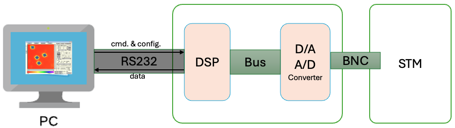

# An Archived Code Repository for Scanning Tunneling Microscope Control

## Overview

This repository houses the GUI source code for controlling a Scanning Tunneling Microscope (STM) using a Digital Signal Processor (DSP). The codebase is organized into two primary sections:

- **Online Communication**: Manages real-time communication with the DSP. [View the associated Assembly Code](https://www.github.com/chenxu2394/stm_asm).
- **Offline Data Processing**: Handles the processing of data captured from the STM off-line.

Communications between the GUI and DSP are facilitated through an RS232 port, with the GUI sending commands to the DSP, which executes them and returns the results.

## STM Control Commands

The GUI controls the DSP through a series of commands sent over the serial connection. Each command is activated by sending a specific character code to the DSP. Here are some example commands:

- **DELAY**: Triggers a delay for a specified number of clock cycles before the DSP responds with a control character. Activate with `d`.
- **INPUT**: Reads 16 bits of data from one of the STM's input channels. Activate with `i`.
- **OUTPUT**: Sends data directly to the STM's electronics. Activate with `o`.
- **VERSION**: Retrieves the firmware version currently installed on the DSP. Activate with `v`.
- **RAMP**: Incrementally adjusts output values over a period. Activate with `r`.

### Detailed Command Descriptions

For a complete list of available commands, refer to the beginning of the assembly code in the linked repository.
